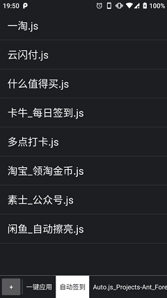
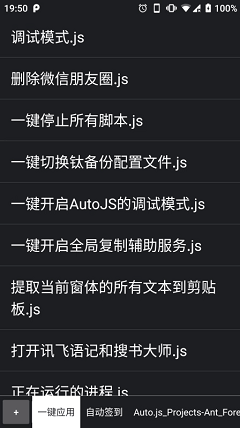
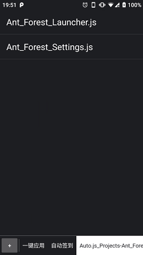
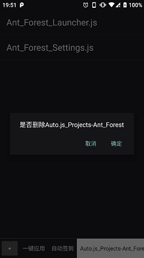

# YeQuickOpenJS

> 快速打开指定的JS脚本(通过`AutoJS Pro`来运行该脚本)

项目初衷:以最少2步即可打开某个目录指定的脚本.

1. 打开`YeQuickOpenJS` APP
2. 打开"脚本"即可.

**需要ROOT**

## 打开“任意目录”指定的脚本的各种方式操作步数对比

### 方法1:常规步骤的步数=3

1. 打开AutoJS APP
2. 打开"某个二级目录"
3. 打开"某个脚本"

### 方法2: 通过悬浮窗按钮的步数=4

假设已经启用"悬浮窗"的情况下

1. 点击"悬浮窗"按钮
2. 点击"运行"按钮
3. 打开"某个二级目录"
4. 打开"某个脚本"

### 方法3:通过桌面小部件(Widget)的步数=1

假设已经在桌面(Lancher)添加了AutoJS的某个目录下的某个脚本的桌面小部件(Widget)情况下

1. 打开"某个脚本"的小部件即可

优点:使用步骤**最少**

缺点:就是添加的步骤步数太多,而且会随着常用脚本的数量增加成倍数增加.

> 假如我有20个常用的JS脚本,则需要操作至少100次(虽然是一次性的).

1. 进入桌面(Lancher)的小部件(Widget)列表
2. 滑动滑动再滑动~找到`Auto.js Pro`的小部件
3. 选中`Auto.js Pro`的小部件
4. 选择脚本所在的"某个目录"
5. 选择脚本

### 方式4:使用`YeQuickOpenJS` APP的步数=2

1. 打开`YeQuickOpenJS` APP
2. 打开"脚本"即可.

额外的步骤是初次打开选择默认脚本所在目录的动作.

## 使用方式

1. 安装 `Auto.js Pro`

   > 支持 `v7`,`v8`版本. `Free开源版本`暂未测试

2. 下载安装`YeQuickOpenJS` APP

   > 下载地址:
   >
   > 1. [Github Releases](https://github.com/asiontang/100.YeQuickOpenJS/releases) 
   > 2. [码云 发行版 ](https://gitee.com/AsionTang/Ye.100.QuickOpenJS/releases) 
   > 3. [酷安网](https://coolapk.com/apk/cn.asiontang.app.quick_open_js) 

3. 首次打开需要选择一个脚本目录

### 排除不需要的文件

1. **长按**不需要的文件即可
2. 会有确认弹窗

### 删除不需要的文件夹

1. **长按**该文件夹即可
2. 会有确认弹窗

## 界面截图

   

## 版本历史

* v200106.01.04.011
    + 增加了排除文件时的确认弹窗

* v191220.01.03.008
    + 首个可用版本
